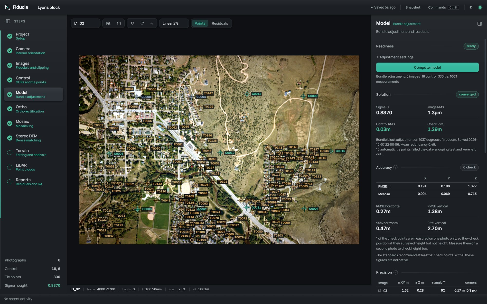

<!--
  Dev notes.

  To post: copy the block below to the TOP of the list (newest first), fill it
  in, save, then commit and push. The site picks it up by itself.

    ## Title of the note
    date: 2026-10-08

    Write the note here. Plain text works. You can also use:
    **bold**, *italic*, `code`, [a link](https://example.com),
    lists starting with "- ", headings starting with "### ",
    quotes starting with "> ", and images: 

  The first paragraph is used as the preview on the home page.
-->

## Welcome to the website
date: 2026-10-08

Fiducia now has a home, with documentation and help. I had a good bit of fun with this. Enjoy the animations and hunt for the hidden interactive elements.
